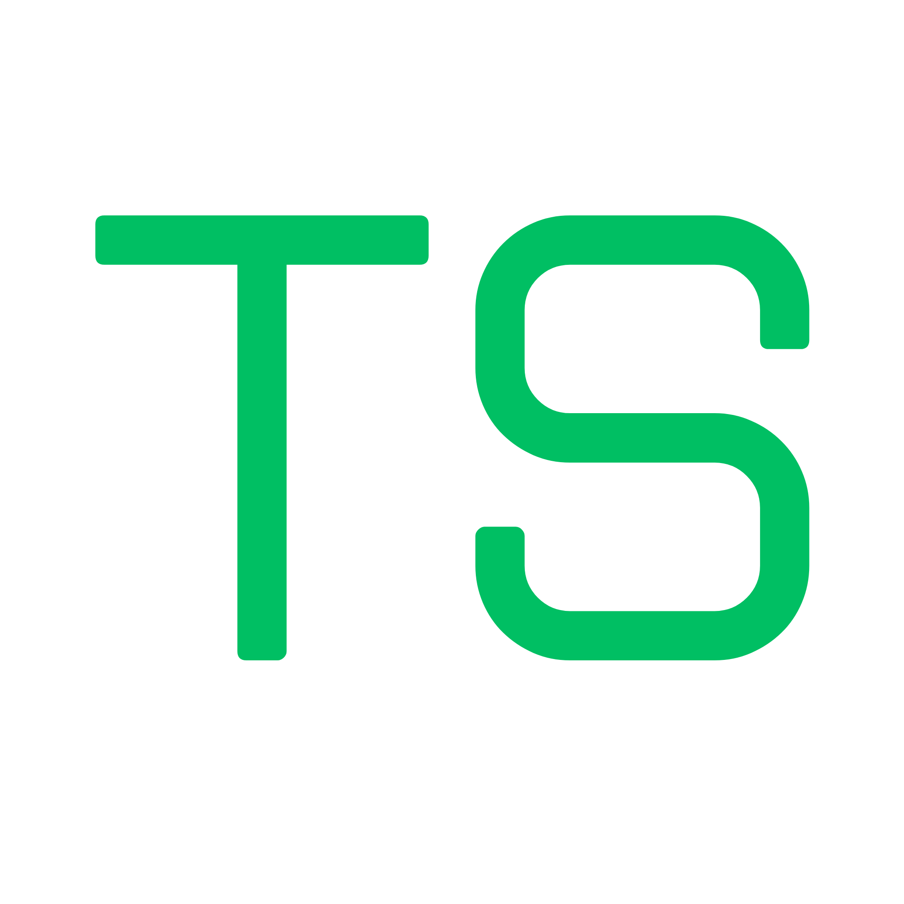

# 

# Testship

> Free, Open source, and Fast Testing for Solana Anchor Programs.

**Bring testing to your program, not your program to the test suite.**

[](https://www.npmjs.com/package/@blockchain-hq/testship)
[](LICENSE)

---

## Quick Start

```bash
# Run directly (recommended)
npx @blockchain-hq/testship start

# Or install globally
npm install -g @blockchain-hq/testship
testship start
```

Opens your browser at `http://localhost:3000`

---

## What is Testship?

Testship lets you test Solana Anchor programs directly in your browser without
writing test files or changing your development environment.

**The Problem:** Traditional testing requires writing tests, manually deriving PDAs, updating tests on every small iteration, and context-switching between code and testing.

**The Solution:** Testship generates interactive forms from your IDL, handles
PDA derivation automatically, and lets you test with your actual wallet.

### Key Features

- **🎯 Zero Configuration** - Just run `testship start` in your Anchor project
- **📝 Auto-Generated Forms** - Forms created automatically from your IDL
- **🔗 Smart PDA Derivation** - Handles complex account-based PDAs automatically
- **💼 Wallet Integration** - Works with Phantom, Solflare, and any Solana wallet
- **⚡ Instant Execution** - Test transactions in seconds, not minutes
- **💾 Account History** - Saves and reuses accounts across instructions
- **🔍 Multi-Program Support** - Detects all programs in your workspace
- **📝 Transaction History** - Keeps track of recent transactions for debugging

---

## How It Works

```bash
# 1. Navigate to your Anchor project
cd my-anchor-project

# 2. Start Testship
testship start

# 3. Testship automatically:
#    ✓ Finds your programs
#    ✓ Loads the IDL
#    ✓ Opens browser
#    ✓ Generates testing interface

# 4. You just:
#    ✓ Select instruction
#    ✓ Fill form (with auto-complete!)
#    ✓ Connect wallet
#    ✓ Execute transaction
#    ✓ See results
```

**No test files. No boilerplate. Just results.**

---

## 🎯 Use Cases

Perfect for:

- 🔨 **Development** - Rapid iteration while building programs
- 🐛 **Debugging** - Quickly test specific scenarios
- 📚 **Learning** - Understand how Anchor programs work interactively
- 🎓 **Teaching** - Demonstrate program functionality to students
- ✅ **Validation** - Verify program behavior before deployment
- 🤝 **Demos** - Show your program to team/investors

---

## Documentation

**Full documentation available at [testship.xyz](https://testship.xyz)**

## ⚠️ Early Release

**v0.1.1** - Actively under development!

### Features ✅

- Load Anchor IDL (auto-detect once run in root of anchor project)
- Execute transactions with real-time feedback
- Auto-derive PDAs from IDL
- Wallet integration (Phantom, Metamask, etc.)
- Form validation and error handling
- Transaction history tracking
- Account management and reuse

**Found a bug? [Report it!](https://github.com/blockchain-hq/testship/issues)**  
**Have feedback? [Share it!](https://github.com/blockchain-hq/testship/discussions)**

We're shipping fixes and features daily. Expect frequent updates!

---

## Contributing

Contributions are welcome! Please feel free to submit issues and pull requests.

---

## Links

- **npm:** [@blockchain-hq/testship](https://www.npmjs.com/package/@blockchain-hq/testship)
- **Website & Docs:** [testship.xyz](https://testship.xyz)
- **GitHub:** [blockchain-hq/testship](https://github.com/blockchain-hq/testship)
- **X:** [@testshipxyz](https://x.com/testshipxyz)

---

## License Status

**Current Status (Oct-Nov 2025):** Restrictive License  
**Future Status (Dec 1, 2025+):** MIT License (Open Source)

This project is temporarily under a restrictive license to protect our original
work during the **Solana Cypherpunk Hackathon**. We believe in open source and
will transition to MIT License as soon as the competition concludes!

### 🎯 What This Means For You

**Right Now (Until Nov 30, 2025):**
| You Can | You Cannot |
|---------|------------|
| ✅ Use Testship as an end user (free!) | ❌ Fork or redistribute |
| ✅ Report bugs and issues | ❌ Submit to competitions |
| ✅ Suggest features | ❌ Create derivatives |
| ✅ Share your experience | ❌ Use commercially without permission |
| ✅ Provide testimonials | ❌ Copy code for your projects |

**Starting December 1, 2025:**
| Everything Above + | Full MIT Freedom |
|-------------------|------------------|
| ✅ Fork and modify | ✅ Use in commercial projects |
| ✅ Contribute via Pull Requests | ✅ Create competing tools |
| ✅ Use in your own projects | ✅ No restrictions! |
| ✅ Redistribute | ✅ Full open source rights |

📖 **Read the full license terms:** [LICENSE](LICENSE)

---

**⭐ If Testship helps you, please consider starring the project!**
